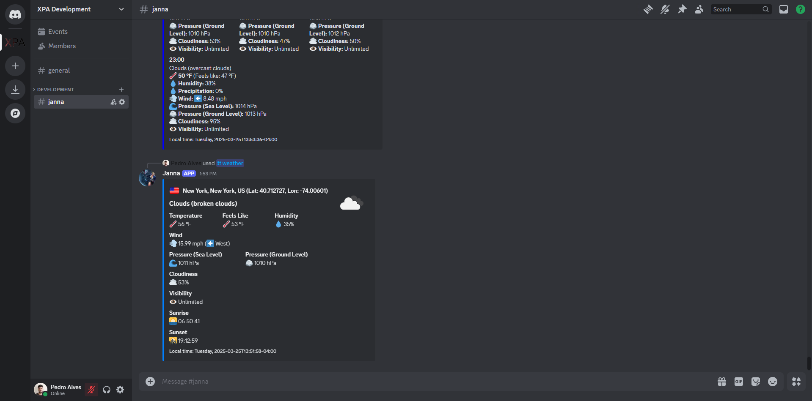

# Janna

A Discord bot that tells you the weather.

## Discord Bot



The discord bot lets you query locations, which can then be used to query the current weather, and the weather forecast for one of the following 5 days.

## Installation and Running

### Docker

#### Prerequisites

- [Docker](https://www.docker.com/)

#### Running

You can use the `compose.yml` file to run the application. Edit the file to add your `DISCORD_BOT_TOKEN` and `OPEN_WEATHER_MAP_TOKEN`.

Start the application with the command:
```
docker compose up -d
```

If you don't want to use the `compose.yml` file, you can run with:
```
docker run -e "DISCORD_BOT_TOKEN=[YOUR_BOT_TOKEN]" -e "OPEN_WEATHER_MAP_TOKEN=[YOUR_API_TOKEN]" --name xpa-janna -d ghcr.io/shadowxpa/janna:1.0.0
```

### Without Docker

#### Prerequisites

- [.NET 8.0 Runtime](https://dotnet.microsoft.com/en-us/download/dotnet/8.0)

#### Running

Download the latest version available on the [Releases](https://github.com/ShadowXPA/Janna/releases/latest) page. Set your environment variables `DISCORD_BOT_TOKEN` and `OPEN_WEATHER_MAP_TOKEN`, then run the application.
